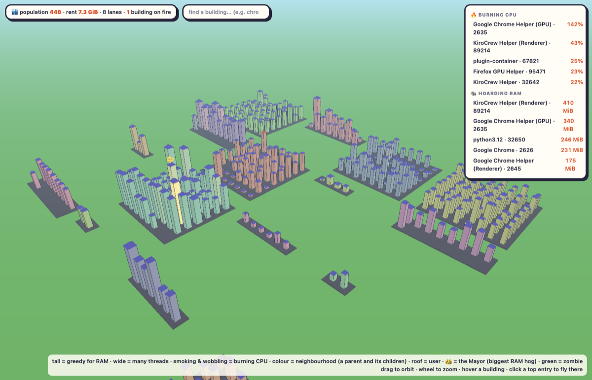

# proccity

Your running processes as a living 3D city. Each building is a process. The city changes as
your system changes: new processes rise out of the ground, dead ones sink, busy ones glow.



- **Height** = resident memory (log scale, so a 10x hog is visibly, not absurdly, taller)
- **Footprint** = thread count
- **Smoke and wobble** = CPU (one full core and the building is visibly having a bad day)
- **Colour** = neighbourhood; **roof colour** = owning user
- **District** = a top-level process and its descendants (a browser and its helpers, a shell
  and what it spawned). Loner processes are pooled into shared "commons" blocks so a typical
  400-process macOS/Linux table is a dense city, not a suburb.

Streets are stable: a process keeps its lot for life, a released lot goes to the next
newcomer, and a family's block is released when the family is gone. Type in the search box
to highlight processes by name; click an entry in the 🔥 Burning CPU / 🐘 Hoarding RAM panel
to fly the camera to it. Walk around with the arrow keys or WASD, rotate with Q / E, zoom
with + / −, press H to go home, or use the on-screen D-pad (works on touch). Honours
`prefers-reduced-motion`.

It is deliberately a cartoon: cel-shaded pastel neighbourhoods with ink outlines, pyramid
roofs, a lazy sun and clouds that are three spheres in a trench coat. Buildings burning CPU
wobble and puff smoke. Zombies are green. Newborns bounce; the dead squash and vanish. The
biggest RAM hog wears a spinning crown and is addressed as the Mayor. Every tooltip ends with
an unsolicited opinion.

## Fun things to do with it

- **Watch `npm install` eat your laptop.** Start it, run the install, and watch a new
  neighbourhood sprout hundreds of buildings and then collapse. Oddly satisfying.
- **Find out what Chrome is doing at 3 am.** Type `chrome` in the box. Everything else fades.
  Count the helpers. Reconsider your tabs.
- **Second-monitor screensaver during a long build.** Compilers are a district that grows,
  smokes, and dies. You will know the build finished without alt-tabbing.
- **`kill -9` therapy.** Find the offender in the 🔥 panel, click to fly there, kill it in a
  terminal, and watch the block squash flat. Better than a stress ball.
- **Explain processes to someone who has never seen `ps`.** Parent and children live on the
  same block; threads make a building wide; memory makes it tall; CPU makes it smoke. A five
  year old gets it. Most onboarding docs don't manage that.
- **Spot a fork bomb before it's a problem.** A single neighbourhood filling every lot and
  spilling into a second block is a fork storm. You'll see it a good ten seconds before the
  fan does.
- **Interview prop.** Ask a candidate why one building is tall but not smoking, or wide but
  short. It's a memory / CPU / threads conversation with a picture, and nobody can bluff it.
- **Compare your tools' appetites.** Docker Desktop, the IDE, the browser and the chat app
  each get their own block. Line them up. Judge quietly.
- **Zombie hunt.** Green buildings are processes that exited but whose parent never called
  `wait()`. Find the parent (same block), have a word with its developer.
- **Impress exactly no one at a party** but yourself, at 3 am, watching your machine breathe.

## Run

```bash
python3 -m venv .venv && .venv/bin/pip install -e .
.venv/bin/proccity            # or: .venv/bin/python -m proccity
# open http://127.0.0.1:8765/
```

Flags: `--port` (default 8765), `--interval` seconds between samples (default 2), `-v`.

## Security model

The snapshot exposes process names, users and memory for this machine, so:

- The server binds `127.0.0.1` only and has no auth: anything that can reach it is already
  on your machine. Do not put it behind a port-forward.
- Requests whose `Host` header is not loopback get `421`. That defeats DNS rebinding, the one
  way a web page you visit could otherwise read a loopback service as same-origin.
- Static files are served from an allowlist of four paths, not a directory.
- The page ships a Content-Security-Policy (no inline script, no eval) whose `script-src`
  allows only the pinned `three@<version>/` path on the CDN, and the Three.js import map is
  version-pinned with SRI `integrity` hashes for every module the app imports, so the CDN
  cannot swap the code under you. The frontend never uses `innerHTML`.
- Only `GET` and `HEAD` are served; other verbs get `405`, and error pages are plain text.
- Response headers: `Cache-Control: no-store`, `X-Content-Type-Options: nosniff`,
  `X-Frame-Options: DENY`, `Referrer-Policy: no-referrer`.

The frontend loads Three.js from unpkg, so the page needs internet on first load. Vendoring
it would remove that dependency; see the review notes for why it is not done yet.

## Test

```bash
.venv/bin/pip install -e '.[dev]'
.venv/bin/ruff check . && .venv/bin/pytest
```

`proccity/layout.py` is a pure module (no psutil, no I/O), so the layout tests cover district
grouping, lot stability, block release and reuse, orphan re-parenting, no-overlap, commons
overflow (a family bigger than a block spills into the commons rather than vanishing) and the
log-scaled height without touching a real process table. The server tests start a real
`ThreadingHTTPServer` on an ephemeral port and check the Host guard, the static allowlist,
the security headers, HEAD/405 handling, keep-alive, that the CSP hash still matches the
import map bytes, that every CDN module the app imports has an SRI hash, and that a clean
wheel actually ships every static file (an editable install hides that).

`tests/test_browser.py` loads the page in headless Chrome under the real CSP + SRI and fails
on any console error or policy refusal, then checks the HUD reached "population N". It skips
without a Chrome binary locally; CI sets `PROCCITY_REQUIRE_BROWSER=1` so a missing browser
there is a failure, not a silent skip. The harness first proves it can see a `console.error`
at all, so a clean console means something.

Review records: [docs/REVIEW-2026-09-29.md](docs/REVIEW-2026-09-29.md) (pass 1, five seats)
and [docs/REVIEW-2026-09-29-pass-2.md](docs/REVIEW-2026-09-29-pass-2.md) (pass 2, six seats).

## Built for fun

A weekend toy inspired by a reel. Not a monitoring tool; use `htop`, `btop`, or your APM for
that. MIT.
